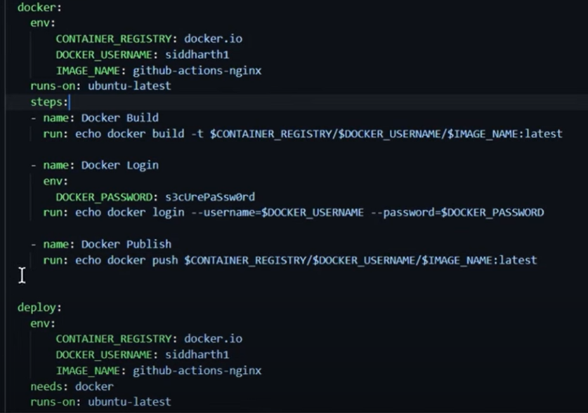

name: Exploring variables and secrets
on:
    push

jobs:
    docker:
        runs-on: ubuntu-latest
        steps:
            - name: docker Build
              run: docker build -t docker.io/dockerUsername/imageName:latest

            - name: Docker login
              run: docker login --username=dockerusename --password=s3cUserPasword

            - name: docker publish
              run: docker push docker.io/dockerUsername/imageName:latest

    deploy:
        needs: docker
        runs-on: ubuntu-latest
        steps:
        - name: Docker Run
          run: docker run -d -p 8080:80 docker.io/dockerUsername/imageName:latest

#refector this workflow with expose username and password using environmnet variables.

#Environment variables representing none sesitive data can be stored in three levels: The step level, The job level and The workflow level
## Step level
# these variables are repeacted at each steps of the workflow.

```
Jobs:
    docker:
        run-on: ubuntu-latest
        steps:
        - name: Docker Build
          env:
            CONTAINER_REGISTRY: docker.io
            DOCKER_USERNAME: manlook01
            DOCKER_PASSWORD: 308VtasYw!
            DOCKER_IMAGE: github-actios-nginex
        run: echo docker build -t $CONTAINER_REGISTRY/$DOCKER_USERNAME/DOCKER_IMAGE/$IMAGE_NAME:latest

```
There are two ways to refer your variable in the command
  1) run: echo docker build -t $CONTAINER_REGISTRY/$DOCKER_USERNAME/DOCKER_IMAGE/$IMAGE_NAME:latest
  2) run: echo docker build -t ${{ env.CONTAINER_REGISTRY}}/${{env.DOCKER_USERNAME}}/${{DOCKER_IMAGE}}/${{IMAGE_NAME:latest}}

  
  The above shows environment varaible define at the level of the job. you only use env at step level if it applies only to that step alone.

Using environment variable at the workflow level

on:
    push

env:
        CONTAINER_REGISTRY: docker.io
        DOCKER_USERNAME: manlook01
        DOCKER_IMAGE: github-actios-nginex

jobs:
    docker:
        runs-on: ubuntu-latest
        steps:
            - name: docker Build
              run: docker build -t ${{ env.CONTAINE_REGISTRY }}/$DOCKER_USERNAME/$IMAGE_NAME:latest

            - name: Docker login
              env:
                DOCKER_PASSWORD: 308VtasYw!
              run: docker login --username=$DOCKER_USERNAME --password=DOCKER_PASSWORD

            - name: docker publish
              run: echo docker $CONTAINER_REGISTRY/$DOCKER_USERNAME/$IMAGE_NAME:latest

    deploy:
        needs: docker
        runs-on: ubuntu-latest
        steps:
        - name: Docker Run
          run: docker run -d -p 8080:80 $CONTAINER_REGISTRY/$DOCKER_USERNAME/$IMAGE_NAME:latest